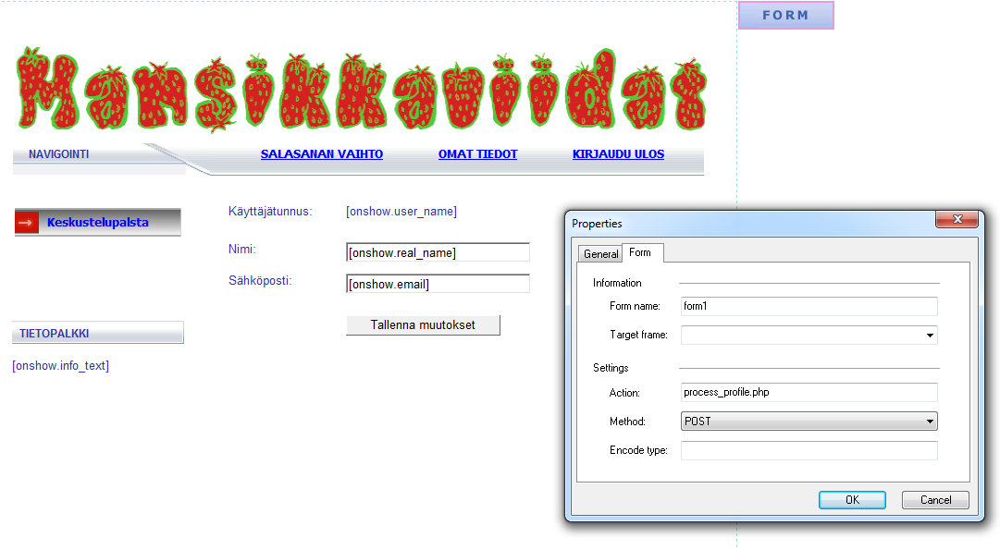
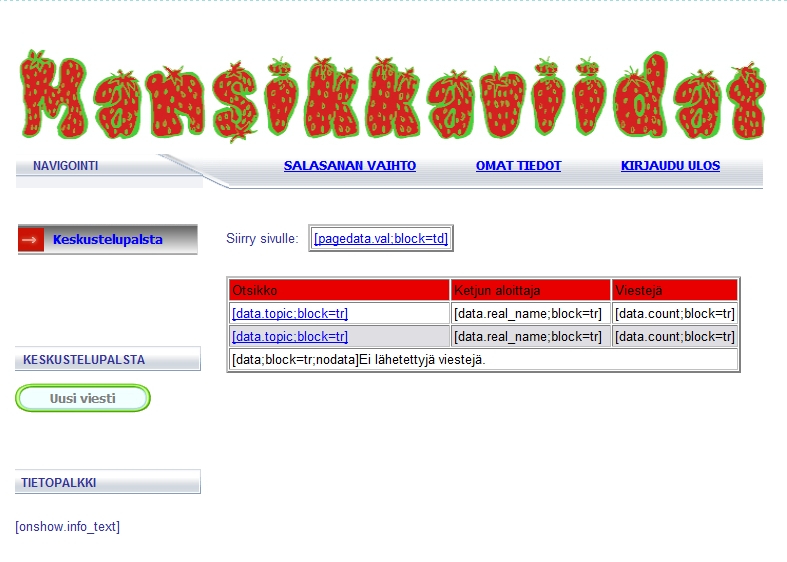
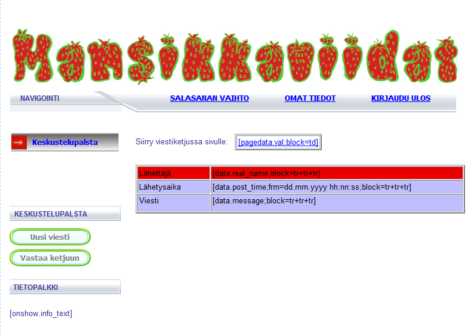
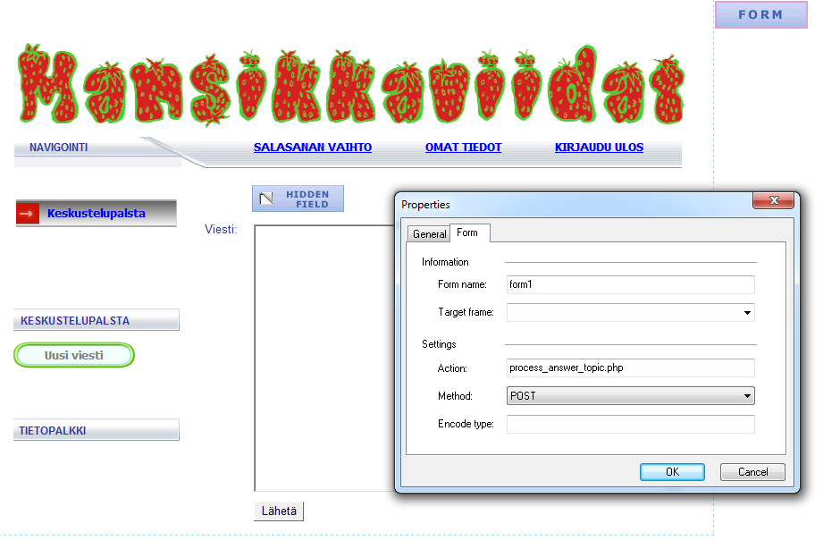

Php Chat Forum
==============

The idea is to demonstrate that it is possible to build a simple website so that the functionality is separated from web design. This makes it possible to allow web designer who has zero experience in programming to modify the design without practically having to touch a single line of code.

This is a basic chat forum that can be set up with PHP and any WYSIWYG Editor. I've been using Web Page Maker ([http://www.webpage-maker.com](http://www.webpage-maker.com/)), which is easy for an amateur to use. I'm also using a template engine called TinyButStrong ([https://www.tinybutstrong.com](https://www.tinybutstrong.com/)) to help with the process.

Using TinyButStrong template engine we only need to determine where the information is displayed. There is a full documentation how to use TinyButStrong in their website, but here are a couple examples to give an idea.

Profile page:

Forum Main Page:

Message chain:

Topic Answering (using a hidden field to identify the topic id):

